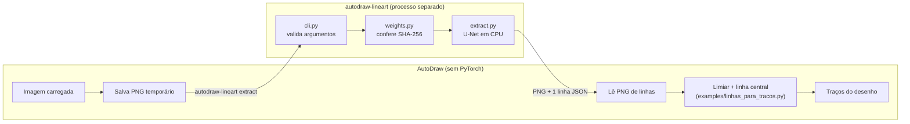
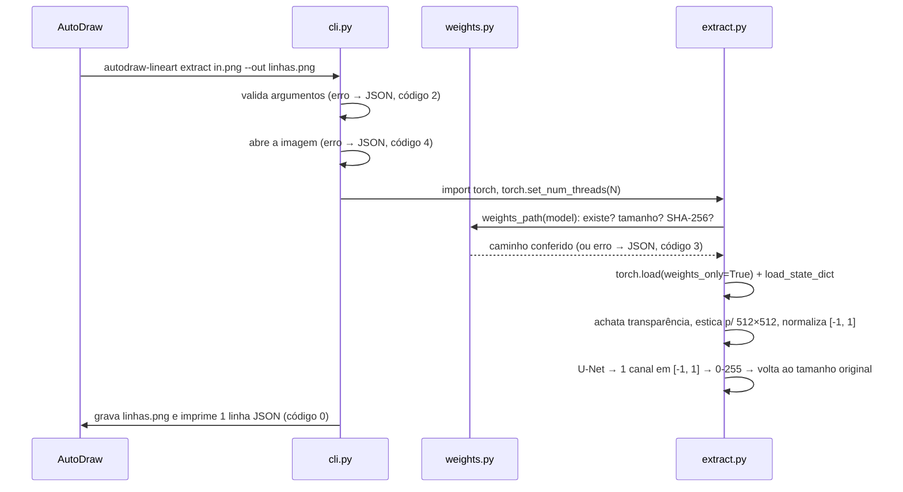

# Arquitetura

## Visão geral

O AutoDraw não importa esta ferramenta: ele a **executa** como outro processo,
passa uma imagem e lê de volta uma imagem de linhas. Toda a IA (PyTorch, pesos,
rede) fica deste lado; o AutoDraw continua leve.

O processo nasce, faz uma imagem e morre: a memória da rede (≈680 MB) volta ao
sistema logo depois, em vez de ficar ocupada enquanto o jogo roda.

## Módulos

| Arquivo | Responsabilidade | Importa PyTorch? |
| --- | --- | --- |
| [`cli.py`](../src/autodraw_lineart/cli.py) | Comandos, validação, resposta JSON e códigos de saída (o contrato) | Só dentro de `extract` |
| [`weights.py`](../src/autodraw_lineart/weights.py) | Registro dos modelos (arquivo, tamanho, SHA-256, ID no Drive), pasta de dados, conferência e download | Não |
| [`extract.py`](../src/autodraw_lineart/extract.py) | Carrega os pesos conferidos, pré-processa, roda a rede, pós-processa | Sim (import tardio) |
| [`network.py`](../src/autodraw_lineart/network.py) | Definição da U-Net, copiada do Anime2Sketch sem mudar a arquitetura | Sim |
| [`__main__.py`](../src/autodraw_lineart/__main__.py) | Permite `python -m autodraw_lineart` | — |

O PyTorch só é importado quando uma imagem vai de fato ser processada. Por
isso `check`, `download` e `--version` respondem em dezenas de milissegundos,
e o AutoDraw pode chamar `check` na inicialização sem custo.

## O que acontece numa chamada de `extract`

Tempos típicos (modelo `default`, 4 threads): ~0,73 s para importar o PyTorch
e carregar os pesos, ~0,1 s de rede. Veja [Desempenho](desempenho.md).

## Pré e pós-processamento

Reproduz exatamente o `test.py` do projeto original (a saída foi conferida
pixel a pixel contra ele):

1. **Transparência** vira fundo branco (`flatten`). Sem isso, PNGs com alfa
   teriam fundo preto e o modelo inventaria linhas nele.
2. **Redimensiona para um quadrado** `size × size` (padrão 512) com bicúbica.
   A proporção é distorcida de propósito: é assim que o modelo foi treinado, e
   a distorção é desfeita no passo 5.
3. **Normaliza** RGB de [0, 1] para [-1, 1].
4. **U-Net** de 8 níveis (por isso `size` precisa ser múltiplo de 2⁸ = 256),
   saída de 1 canal em [-1, 1] (tangente hiperbólica no fim).
5. **Converte** para 0-255 e **volta ao tamanho da entrada**, em tons de cinza
   (`L`): fundo perto de 255, linhas escuras.

## Os dois modelos

| | `default` (`netG.pth`, 2021) | `improved` (`improved.bin`, 2023) |
| --- | --- | --- |
| Diferença na rede | Deconvoluções (`ConvTranspose2d`) na subida | 6 delas trocadas por `Upsample` (bilinear + suavização + conv + MLP) |
| Parâmetros no arquivo | 32 tensores | 62 tensores |
| Tempo / RAM | ≈0,1 s / ≈680 MB | ≈0,35 s / ≈1,8 GB |
| Quando usar | Padrão; ilustrações de fundo claro | Fundos escuros ou de baixo contraste, onde o `default` gera um padrão quadriculado |

A troca de camadas do `improved` é feita em `build_generator(improved=True)`,
na mesma ordem do original. Os nomes dos parâmetros precisam bater com os do
arquivo; um teste confere as contagens (32 e 62) e alguns nomes.

## Onde ficam os pesos

Ordem de busca: `--weights-dir` → variável `AUTODRAW_LINEART_WEIGHTS` → pasta
de dados do usuário:

| Sistema | Pasta padrão |
| --- | --- |
| Windows | `%LOCALAPPDATA%\autodraw-lineart\weights` |
| Linux | `$XDG_DATA_HOME/autodraw-lineart/weights` (normalmente `~/.local/share/...`) |
| macOS | `~/Library/Application Support/autodraw-lineart/weights` |

Os pesos nunca vão para o git (`.gitignore` bloqueia `weights/`, `*.pth`, `*.bin`).

## Threads

`--threads` controla `torch.set_num_threads`. O padrão é **metade dos núcleos,
no máximo 4**: o jogo roda na mesma máquina, e passar de 4 quase não acelera
(0,09 s com 4 contra 0,07 s com 6). O AutoDraw pode passar outro valor.
