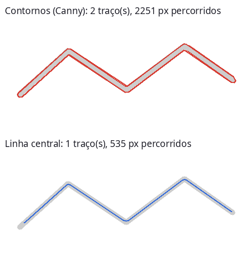
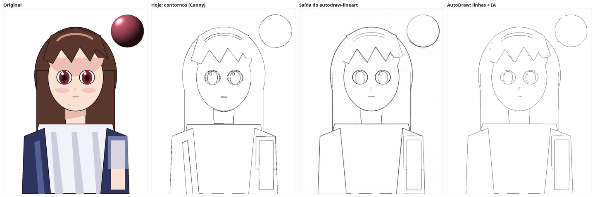
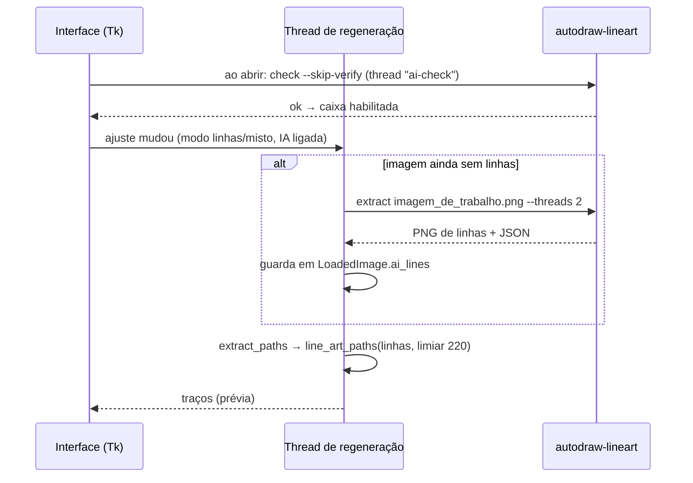

# Integração com o AutoDraw

**Estado: integrado.** Na branch `developer` do AutoDraw:

| Commit | O que entrou |
| --- | --- |
| `dd0589e` | Modo **`linhas`**: traçado pela linha central com caminhos de Euler (`autodraw/centerline.py`) |
| `39b77eb` | Opção **"Linhas por IA"** nos modos `linhas` e `misto`, que chama esta ferramenta |

Este documento explica o que o AutoDraw ganha, como a integração funciona e
o que foi medido.

## O que o AutoDraw ganha

O modo `contornos` detecta bordas com Canny. Isso tem dois problemas, ambos
medidos:

1. **Cada linha é percorrida várias vezes.** Numa linha de 4 px, o Canny acha
   as duas margens e o traçado contorna cada margem indo e voltando. O mouse
   passa pela mesma linha **4 vezes**.
2. **Ruído em ilustrações coloridas:** sombras, reflexos e texturas viram
   pedaços de borda soltos.

Esta ferramenta resolve o segundo (a rede devolve só as linhas de desenho). O
modo `linhas` do AutoDraw resolve o primeiro: percorre cada linha uma vez,
pelo centro, com o mínimo possível de levantadas de caneta.

## Como usar

1. Instale esta ferramenta e baixe os pesos (veja o [README](../README.md#instalação)).
2. Abra o AutoDraw e escolha o modo **`linhas`** ou **`misto`**.
3. Marque **Linhas por IA (autodraw-lineart)**. Se a caixa estiver
   desabilitada, a ferramenta não foi encontrada: use **Localizar…** e
   aponte o executável (`.venv/bin/autodraw-lineart` no Linux,
   `.venv\Scripts\autodraw-lineart.exe` no Windows).

O AutoDraw procura sozinho, nesta ordem: o caminho configurado, o PATH e
`autodraw-lineart/.venv` dentro da pasta do usuário, de `Documents` e de
`Documentos`.

## Resultados medidos

Pelo caminho real da integração (a ferramenta gera as linhas da imagem de
trabalho do AutoDraw, que as traça com o limiar 220). Área de 600×600 px,
velocidade e ajustes padrão; tempo é a estimativa do próprio AutoDraw;
"tinta" é a distância percorrida com o botão pressionado.

**Modo `linhas`**, comparado com o `contornos` de hoje:

| Imagem | `contornos` | `linhas` + IA | |
| --- | --- | --- | --- |
| Ilustração sintética (700×900, abaixo) | 34 traços · 10.852 px · **3,7 s** | 29 traços · 4.774 px · **2,3 s** | ✅ 2,3× menos tinta |
| `madoka.jpg`¹ (anime, fundo claro) | 154 traços · 29.683 px · **12,7 s** | 121 traços · 10.998 px · **7,5 s** | ✅ 2,7× menos tinta, 41% mais rápido |
| `saber.png`¹ (fundo escuro com efeitos), modelo `default` | 127 traços · 15.678 px · **8,7 s** | 454 traços · 16.681 px · **22,4 s** | ❌ o fundo vira ruído |
| `saber.png`¹, modelo `improved` | idem | 270 traços · 10.707 px · **13,6 s** | ❌ melhor, mas ainda pior que o Canny |

**Modo `misto`** (as linhas da IA substituem só a estrutura; a hachura é a mesma):

| Imagem | `misto` | `misto` + IA |
| --- | --- | --- |
| Ilustração sintética | 394 traços · 24.291 px · **21,5 s** | 376 traços · 18.770 px · **19,6 s** |
| `madoka.jpg`¹ | 291 traços · 31.164 px · **18,9 s** | 268 traços · 14.213 px · **14,4 s** |

¹ Amostras de teste que acompanham o projeto Anime2Sketch (`test_samples/`).
Não estão neste repositório porque são *fan art* de terceiros.

Na interface, com a ferramenta real: a primeira extração em cada imagem leva
~1,2 s (a prévia sai em ~2,4 s no total); mexer nos sliders depois **não**
chama a IA de novo.

Repare nos olhos: o Canny desenha anéis duplos; o modo `linhas`, um traço só.

## Como a integração funciona

A ferramenta continua em processo separado; o AutoDraw só a executa. Os
arquivos do lado do AutoDraw:

| Arquivo do AutoDraw | Papel |
| --- | --- |
| `autodraw/lineart_client.py` | Cópia do [cliente de referência](../examples/cliente_autodraw.py), no estilo do AutoDraw (Python 3.9, `Optional`); só biblioteca padrão |
| `autodraw/ai_lines.py` | Localiza o executável; gera a imagem de linhas da **imagem de trabalho** (PNG temporário → `extract` → lê de volta); detecta fundo escuro |
| `autodraw/centerline.py` | Limiar (220 para linhas da IA) → separa linhas de manchas → afinamento Zhang-Suen → grafo → caminhos de Euler |
| `autodraw/image_processing.py` | `LoadedImage.ai_lines` / `ai_error`: o resultado (ou a falha) fica guardado **por imagem** |
| `autodraw/app.py` | Caixa "Linhas por IA", "Localizar…", conferência da ferramenta em segundo plano, chamada na thread de regeneração |

Regras de falha: nada interrompe o uso. Se a ferramenta falhar numa imagem, a
mensagem (já em português) vai para o registro, fica guardada em
`ai_error` para não tentar de novo, e o modo usa o traçado normal.

### Parâmetros

| Parâmetro | Valor | Por quê |
| --- | --- | --- |
| Limiar das linhas da IA | 220 | As linhas do modelo são cinza-claras; 170 perdia os olhos |
| Threads da ferramenta | 2 | O jogo e o AutoDraw rodam na mesma máquina |
| Traço mínimo | metade do `min_contour_length` (slider Detalhes) | No `contornos` o mínimo mede o contorno de um risco, que tem o dobro do comprimento |
| Simplificação | `epsilon` do AutoDraw (slider Precisão) | Mesma do resto do programa |

### Testes do lado do AutoDraw

`tests/test_ai_lines.py` usa um **`autodraw-lineart` falso**: um script de
poucas linhas que segue o contrato e desenha uma linha conhecida. Assim os 15
testes rodam sem PyTorch: localizar a ferramenta, respostas inválidas, tamanho
errado, uso nos dois modos e o recuo quando a ferramenta falta.

## Limitações e como contornar

| Situação | O que acontece | Como contornar |
| --- | --- | --- |
| Fundo escuro com efeitos de luz | `default`: padrão quadriculado; `improved`: manchas; os dois viram ruído (tabela acima) | O AutoDraw avisa no registro quando detecta fundo escuro; desligue a opção nessas imagens |
| Imagem muito alongada | A rede processa um quadrado esticado; detalhes finos no eixo comprimido podem perder definição | `--size 1024` dá mais resolução à rede (~0,3 s e ~270 MB de RAM a mais); o ganho de qualidade **não foi avaliado** e o AutoDraw ainda não expõe essa opção |
| Muitos traços curtos (cabelo, texturas) | Viram muitos traços e muitas pausas de caneta | Subir o slider Detalhes |
| Primeira chamada após ligar o PC | Deve levar mais que ~1 s, porque o PyTorch (772 MB) sai do disco (não medido) | O cliente espera até 120 s |

## Sobre `examples/linhas_para_tracos.py`

É a primeira versão do traçado, mantida como referência simples e com testes.
Ela percorre o esqueleto de forma gulosa. O AutoDraw usa uma versão melhor,
em `autodraw/centerline.py`: o esqueleto vira um grafo percorrido por
caminhos de Euler, o que garante o mínimo de levantadas de caneta sem repetir
trecho (uma cruz em 2 traços, um "#" em 4, um "8" em 1). Para evoluir o
traçado, parta de lá.
